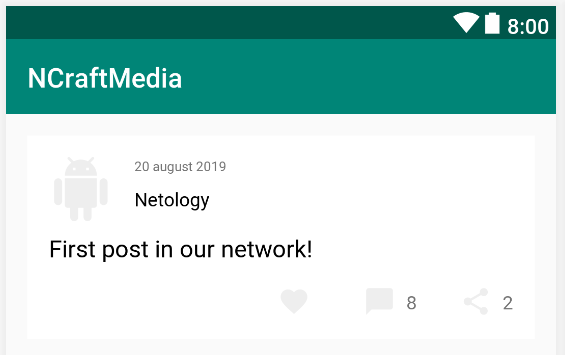
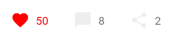
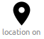
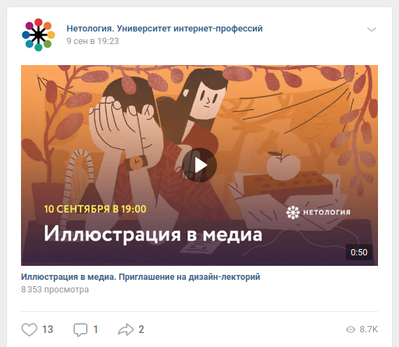

# Домашнее задание к лекции "Функции, лямбды и операторы"

Для каждой задачи создайте решение на базе Gradle и залейте его в GitHub.

Для этого ДЗ вы можете сдавать всё в виде одного проекта, где финальный проект содержит решение всех трёх задач.

Все проекты должны быть созданы с использованием Gradle (без него не принимаются).

Не забудьте про [.gitignore](../.gitignore)

Карточка поста с предыдщуего проекта должна была выглядеть следующим образом:



## Задача №1 - Like/Dislike

Добавьте обработчик кликов на кнопке лайк так, чтобы при лайке менялся цвет иконки и количество лайков рядом:



Т.е. если залайкали - то цвет красный (+1), если нажали ещё раз - то дизлайк (-1) и цвет обычный.

Не забудьте про сценарий, при котором при 0 лайков, текст рядом с кнопкой исчезает:


Т.е. если уже был один лайк (ваш) и вы ещё раз нажали на лайк, то лайков стало 0, текст перестал отображаться, сердечко - серое.

## Задача №2 - Карта

На `Intent`'ах в Android строится большая часть взаимодействия между приложениями, в частности, мы можем задействовать другие приложения для отображения нужного нам контента/выполнения действий и т.д.

Вы можете посмотреть на самые распространённые `Intent`'ы [по ссылке](https://developer.android.com/guide/components/intents-common) (желательно не подглядывать в документацию, пока вы этого не сделали задачу).

Реализуйте специальный тип постов - события. Ключевое у события то, что помимо обычного контента, даты, количества лайков и дизлайков, у них есть ещё два поля:
1. Адрес (строка)
2. Координаты (широта, долгота)

Помимо основного ряда иконок в карточку добавьте иконку location (найдите её в клипартах):



Аналогично коду на лекции, создайте `Intent` с `ACTION_VIEW` (на лекции было `ACTION_SEND`) и установите property `data` следующим образом:
```kotlin
data = Uri.parse("geo:$lat,$lng")
```

Всё это сделайте с помощью `apply`.

Удостоверьтесь, что при использовании данного `Intent`'а открывается приложение с картой.


## Задача № 3 (необязательная) - Youtube

Это исследовательская задача, направленная на приобретение навыков работы с документацией Android и анализа чужих приложений.

Пока мы сами не умеем проигрывать видео, но, как вы наверное догадались, мы можем подключить другие приложения для его проигрывания.

Добавьте в своё приложение возможность проигрывания видео из Youtube.

Продумайте самостоятельно, как вы решите, что это пост с видео, и проанализируйте, как другие приложения отображают интерфейс постов с видео.

Чаще всего это выглядит примерно так:



Подсказки по реализации:
1. Не заморачивайтесь с обложкой, поставьте вместо неё заглушку
1. Для отображения открытия приложения, вам достаточно URL'а вида: "https://www.youtube.com/watch?v=WhWc3b3KhnY" (не забудьте его передать в `Uri.parse`) и `Intent`'а с нужным `action`'ом.
